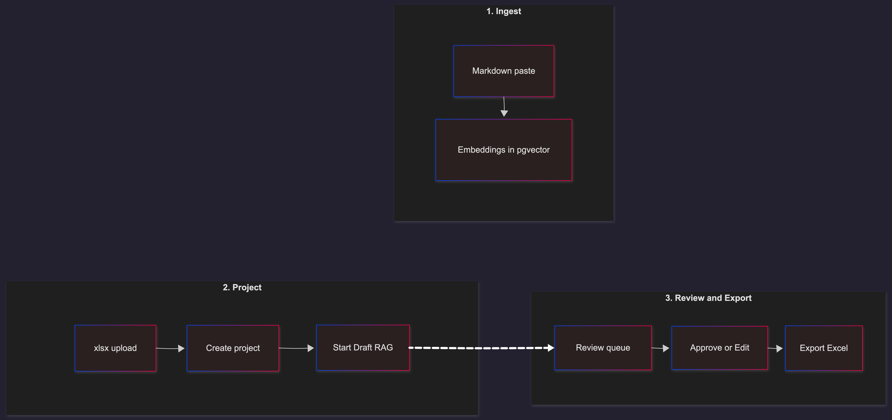
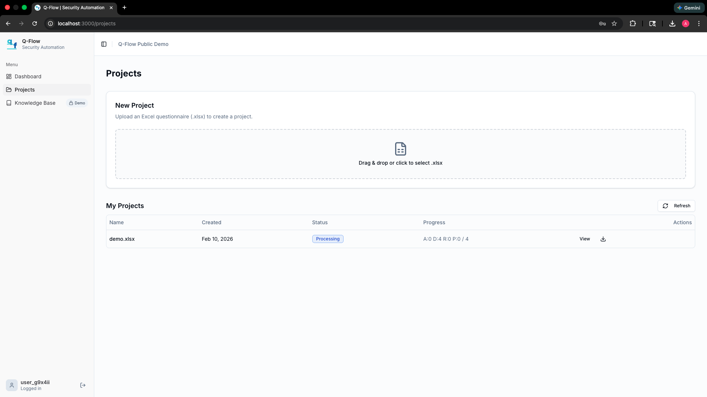
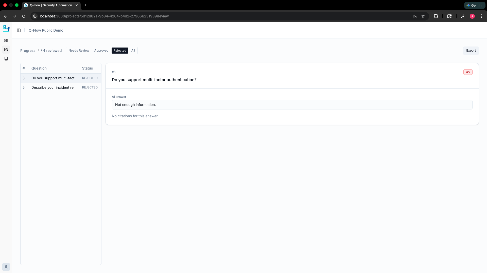

# Q-Flow

> **AI-powered B2B compliance questionnaire assistant**


**Q-Flow** automates security and compliance questionnaires (RFPs) for B2B companies. It ingests your technical documentation, generates draft answers with RAG, and enforces human-in-the-loop review before export.

---

## What It Does

- **Ingests** Markdown content into a vector knowledge base (Postgres + pgvector)
- **Generates** draft answers using RAG: vector search + Gemini, with citations and confidence scores
- **Surfaces** low-confidence answers for mandatory human review
- **Exports** only after all items are reviewed—Excel generated client-side (Question/Answer)

---

## Demo Workflow



---

## Quickstart

### Prerequisites

- Node.js 18+
- Docker & Docker Compose
- pnpm (`npm install -g pnpm`)

### 1. Clone the Repository

```bash
git clone https://github.com/degerahmet/q-flow.git
cd q-flow
```

### 2. Configure Environment Variables

Copy `.env.example` from `apps/api` and `packages/db` into the appropriate locations. Required variables:

| Variable | Description |
| ---------- | ------------- |
| `GEMINI_API_KEY` | Google Gemini API key (embeddings + answer generation) |
| `DATABASE_URL` | PostgreSQL connection string |
| `REDIS_URL` | Redis connection string (e.g. `redis://localhost:6379`) |
| `JWT_SECRET` | Secret for JWT auth |
| `CORS_ALLOW_ORIGINS` | Comma-separated allowed origins (e.g. `http://localhost:3000`) |

### 3. Start Infrastructure

```bash
chmod +x ./docker/initdb/020_shadow_vector.sh
docker-compose up -d
```

Enable the pgvector extension:

```bash
docker exec -it q-flow-postgres-1 psql -U qflow -d qflow -c "CREATE EXTENSION IF NOT EXISTS vector;"
docker exec -it q-flow-postgres-1 psql -U qflow -d qflow_shadow -c "CREATE EXTENSION IF NOT EXISTS vector;"
```

### 4. Install and Run

```bash
pnpm install
pnpm --filter api db:push
pnpm dev
```

- **Frontend:** http://localhost:3000
- **API / Swagger:** http://localhost:3001/api

### 5. End-to-End Flow

1. **Ingest:** Knowledge Base → paste Markdown → Feed → wait for job completion
2. **Create project:** Projects → upload `.xlsx` → preview questions → Create Project
3. **Draft:** Start Draft → wait for processing → items move to NEEDS_REVIEW
4. **Review:** Review → approve/edit/reject each answer
5. **Export:** After all reviewed → Export downloads Question/Answer Excel (client-side)

---

## Key Features

- **RAG + citations:** Vector search over the knowledge base; answers cite source chunks
- **Confidence scoring:** Low confidence → NEEDS_REVIEW; review queue surfaces them
- **Audit trail:** `ReviewEvent` records approve/reject/edit with reviewer and timestamp
- **Export gate:** Export blocked until no NEEDS_REVIEW items; API returns 409 otherwise

---

## Architecture Overview

- **Monorepo:** Turborepo (apps/api, apps/web, packages/*)
- **API:** NestJS, BullMQ, Prisma, Gemini, pgvector
- **Web:** Next.js 16 (App Router), Tailwind, shadcn/ui

### Knowledge Base Processor (ASCII)

```
Job Queue (BullMQ)
    ↓
KnowledgeBaseProcessor.process()
    ↓
[1] Parse Markdown → Concepts[]
    ↓
[2] Create Concept Markdowns → ConceptMarkdown[]
    ↓
[3] For each ConceptMarkdown:
    ├─ Split into Chunks → Chunk[]
    ├─ Generate Embeddings (Gemini) → EmbeddingResult[] (1536-dim vectors)
    └─ Save to Database:
        ├─ Check/Create Document in `documents` table
        └─ Insert Embeddings into `embeddings` table (pgvector)
```

---

## Project Structure

```
q-flow/
├── apps/
│   ├── api/          # NestJS backend + BullMQ workers
│   └── web/          # Next.js frontend
├── packages/
│   ├── api-types/    # Shared DTOs
│   ├── db/           # Prisma schema + migrations
│   ├── eslint-config/
│   ├── typescript-config/
│   └── ui/           # Shared UI components
├── docker/
└── docker-compose.yml
```

---

## API / DTO Notes

- **Projects:** `CreateProjectRequestDto` accepts a `questions` array; `QuestionItemStatus` flows PENDING → DRAFTED → NEEDS_REVIEW → APPROVED/REJECTED
- **Export:** `GET /projects/:id/export` returns `items` with `questionText` and `finalAnswer`
- **Knowledge base:** `POST /knowledge-base/feed` with `text` (Markdown)

---

## Security & Data Handling

- **Closed context:** Answers are based only on the knowledge base. If no relevant chunks are found, the system responds with "Not enough information", confidence 0, and NEEDS_REVIEW.
- **Review gate:** Export is forbidden until no items are in NEEDS_REVIEW; the API returns 409 if not ready.
- **Third-party APIs:** Gemini is used for embeddings and answer generation. Ensure your data complies with your policies regarding third-party AI processors.

---

## Roadmap

- Answer memory reuse (reuse approved answers for similar questions)
- Retries and concurrency controls for draft jobs
- Multi-tenant support
- Eval/metrics for answer quality

---

## Screenshots


*Projects dashboard: upload questionnaire, create project, start draft*


*Review interface: approve, edit, or reject answers with citations*

---

## Contributing

Pull requests are welcome. For major changes, please open an issue first to discuss what you would like to change.
